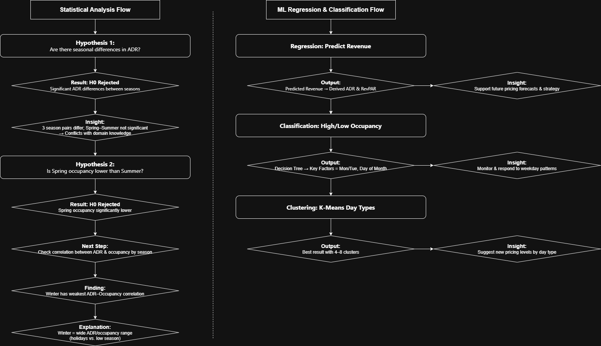

[中文版本](README_zh.md) | [English](README.md)  
  
# Project - Hotel Performance   
  
## Project Overview  
This project includes two sub-projects applying statistical analysis and machine learning techniques to support better operational and pricing decisions by revealing patterns in demand, occupancy, and revenue across different day types and market segments.  
- Statistical Analysis:  
  - **Hypothesis** - Seasonal ADR differences  
  - **Hypothesis** - Occupancy difference between spring and summer  
  - **Correlation** - Relationship between prices and occupancy in seasons  
- ML Regression and Classification:  
  - **Regression** – Predict hotel performance  
  - **Classification** – Predicting occupancy levels  
  - **Classification** – Grouping day types for pricing tiers  
  
The analysis is based on a synthetic dataset simulating realistic hotel performance over a full year (365 days).  
  
---  
## Dataset  
- The dataset is **synthetic**, generated to simulate realistic hotel performance across 365 days.  
- Fields include:  
  - `date`: Calender date in 2023 (used to derive day and month values)  
  - `dayofweek`: Day name (e.g., Monday–Sunday)  
  - `daytype`: Weekday, Peak, or Holiday  
    - *Peak* includes Fridays to Sundays, the day before a holiday, the last day of a holiday, and one-day holiday.  
    - *Holiday* refers to holidays that span **more than one day**, typically combining with a weekend. One-day holidays are not labeled as "Holiday" in this field.  
  - `special_event`: Indicates whether a special event occurs (negative, none, or positive)  
  - `rn_fit, rn_git, rn_corp`: Room nights sold in **FIT**(Free Independent Traveler), **GIT**(Group Inclusive Tour), **Corporate** market segments   
  - `adr_fit, adr_git, adr_corp`: Average Daily Rate (ADR) in each market segments  
  - `rev_fit, rev_git, rev_corp`: Revenue generated in each market segments  
  - `occ`: Occupancy rate (percentage)  
  - `rn_ttl, adr_ttl, rev_ttl`: Total values across all market segments  
  
*Note:  
ADR = Revenue / Room Nights Sold  
RevPAR = ADR × Occupancy*  
  
--- 
## Project Sections  

### Statistical Analysis  
1. **Hypothesis 1 – Seasonal ADR Differences**  
   *Null Hypothesis (H0): There is no significant difference in prices (ADR) between seasons.  
   Alternative Hypothesis (Ha): At least one season's prices (ADR) differs.*  
  
   **Features**:  
   - Seasons (Spring, Summer, Fall, Winter)  
   - ADR  
  
   **Models**:  
   - One-way ANOVA  
   - Tukey's Range Test  
  
   **Goal**: To prove seasonality in the hospitality industry and support pricing strategy.  
  
2. **Hypothesis 2 – Occupancy Difference Between Spring and Summer**  
   *Null Hypothesis (H0): There is no significant difference in occupancy between Spring and Summer.  
   Alternative Hypothesis (Ha): There is a significant difference in occupancy between Spring and Summer.*  
  
   **Features**:  
   - Seasons (Spring, Summer)  
   - Occupancy rate  
  
   **Models**:  
   - two-sample t-test  
  
   **Goal**: Since Hypothesis 1 found no significant difference in ADR between spring and summer, despite domain expectations that summer should be higher, a follow-up hypothesis was tested to compare occupancy instead, to explore if spring's prices may be too high.  
  
3. **Correlation – Relationship Between Prices and Occupancy in Seasons**  
   A scatter plot was created for ADR vs. occupancy within the spring season. Pearson correlation coefficients were calculated for each season.  
  
   **Features**:  
   - Seasons (Spring, Summer, Fall, Winter)  
   - ADR  
   - Occupancy rate  
  
   **Models**:  
   - Pearson correlation coefficients  
  
   **Goal**: To explore whether high spring ADR leads to lower occupancy, and to reveal the strength of the relationship between ADR and occupancy in each season.  
  
### ML Regression & Classification  
1. **Regression – Predicting Hotel Performance**  
   Use regression models, both linear and non-linear, to predict **total daily revenue** and derive ADR and RevPAR.  
  
   **Features**:  
   - Room nights sold by market (FIT, GIT, Corp)  
   - Occupancy rate  
   - Day of week (Monday–Sunday)  
   - Day type (Weekday, Peak, Holiday)  
  
   **Models**:  
   - Multiple Linear Regression  
   - Random Forest Regression  
  
   **Goal**: Estimate expected revenue based on operational and calendar variables to support future pricing strategies.  
  
2. **Classification – Predicting Occupancy Levels**  
   Classify whether a day will have **high occupancy (≥60%)** or **low occupancy (<60%)**.    
  
   **Features**:  
   - Day of the month (1st–31st)  
   - Day of week (Monday–Sunday)  
   - Day type (Weekday, Peak, Holiday)  
   - Special event impact (Negative / None / Positive)  
  
   **Model**:  
   - Decision Tree Classifier  
  
   **Goal**: Identify days likely to have low occupancy, enabling targeted promotions or pricing strategies.  
  
3. Clustering – Grouping Day Types for Pricing Tiers  
   Use clustering to explore whether the existing day types (Weekday, Peak, Holiday) are sufficient or if more granular categories are needed.  
  
   **Features**:  
   - Room nights sold by market (FIT, GIT, Corp)  
   - Revenue by market (FIT, GIT, Corp)  
  
   **Model**:  
   - K-Means Clustering  
  
   **Goal**: Discover new pricing tiers (e.g., event weekends, peak-season weekdays) based on performance, supporting more nuanced pricing strategies.  
  
---  
## Project Structure  
Project - Hotel Performance/  
├── data/  
│   └── Mock_Hotel_daily.csv  
├── notebooks/  
│   └── 01 - Hotel Performance - Statistical Analysis.ipynb  
│   └── 02 - Hotel Performance - ML Regression and Classification.ipynb  
├── project_flow/  
│   └── Project_Flow_Diagram.png  
├── .gitignore  
├── README.md  
└── requirements.txt  
  
---  
## Installation  
### Option 1: With pip  
```bash  
pip install -r requirements.txt  
```
### Option 2: With Conda  
You can manually create a conda environment and install packages listed in requirements.txt:  
```
conda create -n hotel-ml python=3.10  
conda activate hotel-ml  
pip install -r requirements.txt
```
*Note: Python 3.10 is recommended to ensure compatibility, but you can change the version if needed.  
Also, you can replace hotel-ml with any environment name you prefer.*  
  
---
## Results  
### Statistical Analysis  
- **Hypothesis 1 - Seasonal ADR Differences**  
  - Null Hypothesis (H0) rejected; significant ADR differences exist between seasons.  
  - Tukey’s test shows significant differences between Fall–Summer, Fall–Winter, and Spring–Winter.  
  - ADR difference between Spring and Summer is not statistically significant, contradicting domain knowledge that summer should be the peak season. This raised the question of whether spring’s ADR was set too high.  
- **Hypothesis 2 - Occupancy Difference Between Spring and Summer**  
  - Null Hypothesis (H0) rejected; significant occupancy difference found.  
  - Suggests high ADR in spring may be suppressing demand.  
  - However, ADR and occupancy in spring still show a positive correlation.  
- **Correlation - Relationship Between ADR and Occupancy**  
  - Winter has the weakest correlation (r = 0.26), while other seasons range from 0.34–0.41.  
  - Boxplots show a **wider distribution in both ADR and occupancy** during winter, indicating higher variability.  
  - Domain experience: This is likely due to a mix of **strong demand in December** and **low demand in January and February**, except during Chinese New Year.  
  - This seasonal inconsistency weakens linear relationships and may indicate price inelasticity during winter.  
  
### Hotel Performance - ML Regression and Classification  
- A correlation heatmap shows that total revenue has a **positive relationship** with FIT room nights, occupancy rate, Saturdays, and Holidays. Although GIT and Corporate room nights help fill low-demand days, they are **negatively correlated** with total revenue, likely due to lower ADR in those segments.  
  **This insight supports strategic room allocation across market segments.**  
- **Regression – Predicting Daily Revenue**  
  - Both Linear Regression and Random Forest Regression successfully predict total revenue, ADR, and RevPAR.
  - Results help in forecasting and optimizing pricing.  
- **Classification – Predicting Occupancy Levels**  
  - Initial decision tree overfit the data. After pruning and tuning, model performance improved.  
  - Key insight: monitor **Tuesdays at the end of each month** and **Mondays at the beginning**, which tend to be lower occupancy.  
  - Currently, the occupancy classification includes all market segments.
      - Domain experience: In real-world operations, **GIT and Corporate bookings** are often used to fill low-demand days and do not follow a consistent weekly pattern like FIT bookings.
      - Including them may introduce noise into the model and reduce predictive accuracy.
      - A better approach may be to classify based on **FIT-only occupancy or revenue**, which would provide a cleaner signal for organic demand and help determine when **GIT/Corporate support** is truly needed.  
- **Classification - Grouping Day Types for Pricing Tiers**  
  - K-Means suggests **4–8 meaningful clusters** beyond the current weekday/peak/holiday categorization, supporting the idea of more granular pricing tiers.  
  - Based on domain experience, we may consider separating **Saturdays** from other peak days, or defining **special weekday/peak patterns** during **seasonal breaks** (e.g., summer or winter holidays).  
  - This refined day type classification may enhance may enhance pricing strategies and improve ML models accuracy.  
- Visualizations include **correlation heatmaps**, **decision tree diagrams**, and **cluster visualizations** (see notebook).  
  
---
## Future Improvements  
- **Expand the dataset** by including data from multiple past years to capture seasonal trends and unusual patterns.  
- **Train and validate models with real-world data** to improve performance and generalizability.  
- **Refine the day type classification** to better reflect pricing behavior and occupancy patterns, potentially improving model accuracy.  
- **Incorporate external factors** such as weather conditions or local events, which may have a strong influence on occupancy and revenue.  
- **Leverage historical competitor performance data** (e.g., from benchmarking reports) to better position the hotel's pricing and predict market behavior.  
  *Note: This would require real-world data sources and is not applicable to the current synthetic dataset.*
- **Refine classification targets** by focusing on **FIT-only occupancy or revenue**, reducing noise from inconsistent GIT/Corp availability and better identifying truly low-demand days.  
- **Develop an interactive dashboard** to visualize trends, model outputs, and support decision-making by hotel management.  
- **Apply the models to a full future year** for forward-looking predictions to support pricing strategy and resource planning.
  
---
## License  
This project uses synthetic data generated solely for educational and demonstration purposes. It does not reflect real hotel operations or confidential business information.  
All analysis and code are intended for non-commercial academic use.  

