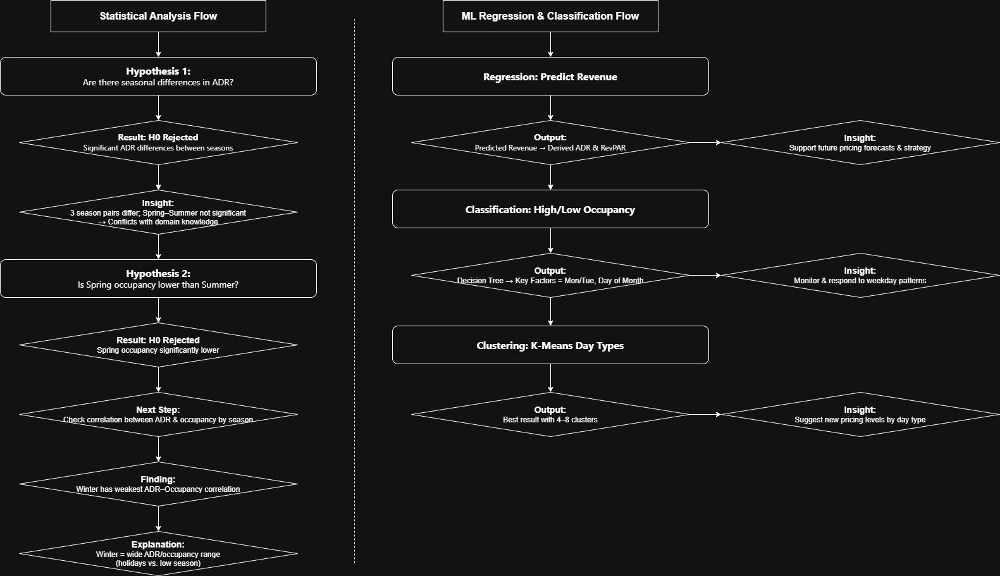

[中文版本](README_zh.md) | [English](README.md)   
   
# 專案 - 飯店營運績效  
## 專案概述  
本專案結合統計分析與機器學習兩部分，透過分析不同日別與市場區隔下的需求、住房率與營收趨勢，協助做出更有效的營運與定價決策。  
- 統計分析部分:
  - **假設檢定** - 平均房價季節差異
  - **假設檢定** - 春季和夏季間的住房率
  - **相關性分析** - 各季節平均房價與住房率間的關係
- 機器學習回歸與分類部分:  
  - **迴歸分析** - 預測飯店績效  
  - **分類分析** – 預測住房率高低  
  - **分群分析** – 日別劃分以做為訂價層級參考  

本分析使用模擬飯店一整年的營運情形（365天）的合成資料。  
  
---
## 資料集  
- 資料為合成資料，模擬 2023 年度 365 天的飯店營運表現。  
- 欄位包含：  
  - `date`: 2023年日期(用以擷取月份與日期)  
  - `dayofweek`: 星期幾(例如：星期一至星期日)  
  - `daytype`: 日別，平日、旺日、假日  
    - *旺日* 包含星期五至星期日、假日前一天、假期最後一天及單日假日  
    - *假日* 指連續假期(不包含只有一天的國定假日)  
  - `special_event`: 是否有特殊事件(負面、無、正面)  
  - `rn_fit, rn_git, rn_corp`: 各市場**FIT**(散客)、**GIT**(團客)、**Corp**(商務)房晚數  
  - `adr_fit, adr_git, adr_corp`: 各市場平均房價(ADR)  
  - `rev_fit, rev_git, rev_corp`: 各市場營收  
  - `occ`: 住房率(百分比)  
  - `rn_ttl, adr_ttl, rev_ttl`: 各市場總和  

*註：
平均房價(ADR) = 營收 / 房晚數
RevPAR = 平均房價 × 住房率*  

--- 
## 專案內容

### 統計分析  
1. **假設檢定1 - 平均房價季節差異**  
   *虛無假設 H0：各季節沒有顯著平均房價差異  
   對立假設 Ha：至少一個季節的平均房差有顯著差異*  
  
   **Features**:  
   - 季節(春、夏、秋、冬)  
   - 平均房價  
  
   **模型**:  
   - 單因子變異數分析(ANOVA)  
   - 杜凱氏事後多重檢驗(Tukey's Range Test)
  
   **目的**: 驗證飯店業常見的季節性價差是否顯著，提供定價策略依據。       
  
2. **假設檢定2 - 春季和夏季間的住房率**  
   *虛無假設 H0：春季與夏季間沒有顯著住房率差異  
   對立假設 Ha：春季與夏季間存在著顯著住房率差異*  
  
   **Features**:  
   - 季節(春、夏)
   - 住房率  
  
   **模型**:  
   - 雙樣本T檢定(two-sample t-test)  
  
   **目的**: 前一檢定發現春、夏平均房價無顯著差異，根據業界經驗夏季應為價格較高的旺季，因此本檢定進一步比較住房率，檢驗春季是否定價過高造成低住房率。  
  
3. **相關性分析 - 不同季節中價格與住房率的關係**  
   透過散佈圖觀察春季平均房價與住房率的關係，並計算各季節間的皮爾森相關係數。  
  
   **Features**:  
   - 季節(春、夏、秋、冬)
   - 平均房價  
   - 住房率  
  
   **模型**:  
   - 皮爾森相關係數(Pearson correlation coefficients)  
  
   **目的**: 分析春季是否因價格過高導致住房率下降，並比較不同季節價格與住房率間的關聯強度。  

### 機器學習回歸與分類  
1. **迴歸分析：預測飯店績效**  
   使用迴歸模型(包含線性與非線性)來預測每日總營收，並推算出平均房價與RevPAR。  
  
   **Features**:  
   - 各市場房晚數(散客、團客、商務)  
   - 住房率  
   - 星期幾(星期一至星期日)  
   - 日別(平日、旺日、假日)  
  
   **模型**:  
   - 多元線性迴歸(Multiple Linear Regression)  
   - 隨機森林迴歸(Random Forest Regression)
  
   **目的**: 依據營運與日期特徵預測每日營收，支援定價與營運規劃。  
   
2. **分類分析 - 預測住房率高低**  
   預測某日是否為**高住房日(≥60%)**或**低住房日(<60%)**  
  
   **Features**:  
   - 日期(1日至31日)  
   - 星期幾(星期一至星期日)  
   - 日別(平日、旺日、假日)  
   - 特殊事件(負面、無、正面)  
  
   **模型**:  
   - 決策樹模型(Decision Tree Classifier)  
  
   **目的**: 判別可能出現低住房率的日子，作為促銷或價格調整的依據。  
  
3. **分群分析 - 日別劃分以做為訂價層級參考**  
   探討現有的日別類型(平日、旺日、假日)是否足夠，是否應該建立更細緻的日別類型，以更有效地支援定價策略   
  
   **Features**:  
   - 各市場房晚數(散客、團客、商務)  
   - 各市場營收(散客、團客、商務)  
  
   **模型**:  
   - K-Means Clustering  
  
   **目的**: 根據飯店績效趨勢進行劃分，尋找潛在的新日別類型（例如：旺季平日、星期六、有活動的週末），以建立比原始三分類系統（平日、旺日、假日）更有效的定價級距。  
  
---  
## 專案結構  
Project - Hotel Performance/  
├── data/  
│   └── Mock_Hotel_daily.csv  
├── notebooks/  
│   └── 01 - Hotel Performance - Statistical Analysis.ipynb  
│   └── 02 - Hotel Performance - ML Regression and Classification.ipynb  
├── project_flow/  
│   └── Project_Flow_Diagram.png  
├── .gitignore  
├── README.md  
└── requirements.txt  
  
---  
## 安裝方式  
### 使用 pip  
```bash  
pip install -r requirements.txt  
```
### Option 2: 使用 conda  
您可以手動建立 Conda 環境並安裝 requirements.txt 中列出的套件:  
```
conda create -n hotel-ml python=3.10  
conda activate hotel-ml  
pip install -r requirements.txt
```
*注意：建議使用 Python 3.10 以確保相容性，但您也可以根據需要更換版本。  
此外，hotel-ml僅為示範用的環境名稱，您可以自由替換為您偏好的名稱。*  
  
---
## 結果摘要  

### 統計分析  
- **假設1 - 平均房價季節差異**  
  - 虛無假設檢定拒絕，季節間存在顯著平均房價差異。  
  - 秋夏季、秋冬季、春冬季等組合有顯著平均房價差異。  
  - 然而春夏之間平均房價未達到統計上的顯著差異，與夏為旺季的領域經驗不符，可能代表春季定價過高。  
- **假設2 - 春季和夏季間的住房率**  
  - 虛無假設檢定拒絕，春季和夏季間存在顯著住房率差異。  
  - 顯示春季價格高於需求。  
  - 然而春季平均房價與住房率之間仍呈現正向相關。  
- **相關性分析 - 各季節平均房價與住房率間的關係**  
  - 冬季的平均房價與住房率顯示出最低的相關度(r = 0.26), 其他季節則介於0.34至0.41之間。  
  - 盒鬚圖顯示，冬季的房價與住房率皆呈現**較大的分布範圍**。  
  - 根據領域經驗，冬季同時包含了**較旺的12月**，而**1-2月(除農曆春節外)則為最淡的月份**，形成需求有**高峰低谷**的大幅波動情形。
  - 這些季節因素的不穩定性，可能削弱價格與住房率間的線性關係，並降低價格彈性。  
  
### 機器學習回歸與分類  
- 從相關係數熱力圖得出，總營收與散客房晚數、住房率、週六與假日皆有**正相關**。實務上，團客和商務客常用來填補低住房率日期，因其平均房價較低，因此與總熟收有**負相關**。  
  **這有助於未來分配各市場房間策略。**  
- **迴歸分析 - 預測飯店績效**  
  - 透過**線性回歸**與**隨機森林回歸**有效預測每日營收、平均房價與RevPAR。  
  - 可用於做為未來訂價策略參考。  
- **分類分析 - 預測住房率高低**  
  - 初始**決策樹**出現過度擬合，經調整參數與剪枝後改善。  
  - 結果顯示**月底的星期二**與**月初的星期一**可能會有低住房率，需特別注意。  
  - 目前此預測住房率高低的分群分析包含**所有市場類別**  
    - 然而根據領域經驗，**團客與商務客**常被用來填補淡日，因此其數量波動較大，未必呈現明顯的每週趨勢。  
    - 這些因素可能為模型帶來雜訊，進而降低預測準確度。  
    - 未來可考慮**單純以散客**為目標進行分類，以排除團客與商務客的不穩定性，提升模型效率，並在淡日需要**團客和商務客**協助時，提供更可靠的參考。  
- **分群分析 - 日別劃分以做為訂價層級參考**  
  - K-Means顯示，相較於原始的3個日別分類，**4–8個日別**是比較適合的，可用於未來訂價層級的參考。  
  - 基於領域經驗，可考慮將**週六**自旺日獨立出來，或是根據**旺季(暑假及寒假)**進行更細緻分類。  
  - 調整日別分類可以強化價格策略，也可能改善前兩個迴歸分析與分類分析的準確性。  
- 視覺化包括 **correlation heatmaps**, **decision tree diagrams**, and **cluster visualizations** (請見 notebook)。  
  
---
## 未來改進方向  
- **擴充資料** 加入更多年份的歷史資料，以更全面反映季節性與異常波動。  
- **使用真實資料進行訓練與驗證** 以提升準確度與泛化能力。  
- **重新定義日別類型** 以更精準反映出飯店價格與績效趨勢，並提升模型準確度。  
- **納入外部因素** 例如氣候或大型活動可能會對住房率和營收有重要的影響。  
- **參考歷史競爭對手資料** 以更進一步探索價格及市場趨勢。  
  *註: 需使用真實世界資料，不適用於本合成資料*  
- **重新定義分群目標** 以**單純散客**為主進行分群，排除團客及商務客不穩定所帶來的雜訊，以更準確判斷低需求日。  
- **建立互動式儀表板** 以供經營管理團隊參考趨勢及預測。  
- **應用於未來整年度資料** 以模型預測結果來做為營運與定價策略的參考。  
  
---
## 授權聲明    
本專案為個人實作用途，所使用資料為合成模擬資料，無任何實際飯店營運數據。未經允許請勿任意使用、發佈或再製此專案內容。  

